# Milestone 1 - Magician/Mentalist

## Contents

 ## Project Aims
 

 
click to expand

 * ### [1.who is this for and why they need a website](#who-is-this-for-and-why-they-need-a-website)
 * ### [2.project aim](##-PROJECT-AIM)
 * ### [3.website needs](#website-needs)
 * ### [4.website design needs](#website-design-needs)
 * ### [5.user needs](#user-needs)
 

 ## Design Choices
 

 
click to expand

 * ### [6.Action Plan](#action-plan)
 * ### [7.wedsite design choices](#website-design-choices)
 * ### [8.website navigation](#website-navigation)
 * ### [9.website footer](#website-footer)
 * ### [10.website main body](#website-main-body)
 * ### [11.website colours](#website-colours)
 * ### [12.font family](#font-family)
 * ### [13.wireframes, sketched layout](#wireframes,-sketched-layout)
 

 ## Website Build
 

 
click to expand

  * ### [14.design changes](#design-changes)
  * ### [15.code structure](#code-structure)
  * ### [16.code bugs/fixes](#code-bugs/fixes)
   

 ## Final Website
 

 
click to expand

  * ### [17.final product](#final-product)
  * ### [18.references](#References/-Credits)
   

 ## Evaluations
 

 
click to expand

 * ### [19.Deployment](#deployment)
  

## WHO IS THIS FOR AND WHY THEY NEED A WEBSITE

I perform as a magician and mentalist, performing magic tricks and mind reading effects at parties,weddings, birthdays and other organised events. My act is unique as it combines traditional magic tricks  with traditinal mentalism effects reinvented for a mordern day audience. My act comes in three types of performance, close up/walkaround, parlour and stage. I take bookings for my performances and most of my bookings are aquired by word of mouth. Across the country there are lots of magicians available to book however no two magicians are the same, each magician has his or her own unique style and method of performing. In this case it is important for anyone booking a magic act to understand what type of magician they want to book and what type of act. For the magician it is important to showcase his or her own unique style and type of act they are able to perform. To help showcase this for me, I have decided to build a website to help potenial bookers get a feel and understsanding of myself as a performer and what kind of performances I do. It can also provide a way of communicating any queries regarding my services or enquirie to potenial bookings.

## PROJECT AIM 

The aim of the project is to build a website that describes the performer and the services that they provide and a way of contacting the performer with questions or enquires.

## WEBSITE NEEDS (business needs)

- To explain the type of performer the magician is.

- To explain the type of acts the performer can provide 

- Examples of different situations/events in which the performer and their acts are best suited

- A way for anyone visiting to make enquries 

- Showcase the performers ability

## WEBSITE DESIGN NEEDS

- Website site needs to be mordern and stylish

- Unique to the performer

- Simple and easy to use

- Viewable on all sizes of devices

- website will be built with HTML,CSS

## USER NEEDS 

- Whos website they are on, and what service they are providing.

- quickly establish where to find the information they are looking for.

- To get a feel and understanding for the performer and their ability.

- To get an understanding of the type of service they are likely to get.

- How they go about aquiring that service.

## ACTION PLAN

To achieve the aim of the project I'm going to design a website consisting of 4 pages, a home page, an about page, a gallery page and a contact page.

### The Home Page

- The Home page will be the main opening page of the site, it will contain content with the overview of website, basic information describing what the web page is for and where to find relavent information.

### The About Page 

- The about page will have content about the performer him self and a description of the acts he performs and examples of when and where those acts are best suited.

### The Gallery Page

- The gallery page will be a collection of photos showcasing the performer in action performing at different events.

### The Contact Page 

- The contact page will be where visitors to the site can fill out an enquiry form to pose a question or enquire about a potenial booking.

## [Back to top](#contents)

## WEBSITE DESIGN CHOICES

### Website Navigation

- To help visitors move between the pages I'm going to input a navbar. This will sit in the header of main body of the page. 
To keep the website simple and easy to use I'm going to have the same header on every page of the site. This will help visitors intuitively understand how to move around the website.

- The header will consist of the name of the performer and performance type and navbar.

### Website Footer

- The Footer will consist of email contact details for the performer and performers local location and distance willing to travel.

- Like the Header and navbar the footer will be the same across all four pages of the site, giving the user opportunity to quickly access additional social media links or contact perofrmer from any page on the site.

- As an addition to the website I will also add links to social media for the performer, this will be placed in the footer opening in a separate tab giving the user oppertunity to find further information on the performer and also allowing them to remain on the website.

### Website Main body

- This is the area in between the header/navbar and footer where the main content as described in the action plan will sit on each page.

### colours 

- I have choosen colours for the website based off a few promotional photos for the performer, I will be using these photos as the main images on the site and will base the colours on the photos.

- color used shadows - #2125 color used shadows - #2125
- color used for header - #343a40
- color used for titles - rgb(40, 126, 175)
- color used for text - aliceblue

### Font Family 

- The font choosen for the website is Aclonia with sans-serif backup from google fonts :https://fonts.google.com/specimen/Aclonica 

- The font was choosen as it is stylish but still clear and easily readable. To keep the flow and look of the website simple but stylish the same font is used throughout the site.
 

## WIREFRAMES, SKETCHED LAYOUT

- Main home page layout -

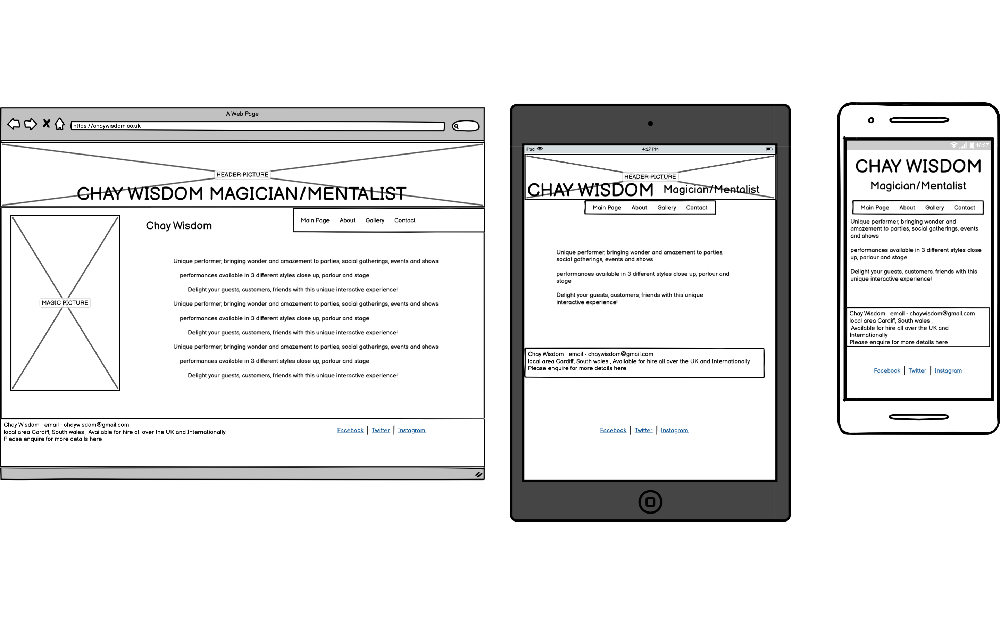

- About page layout -

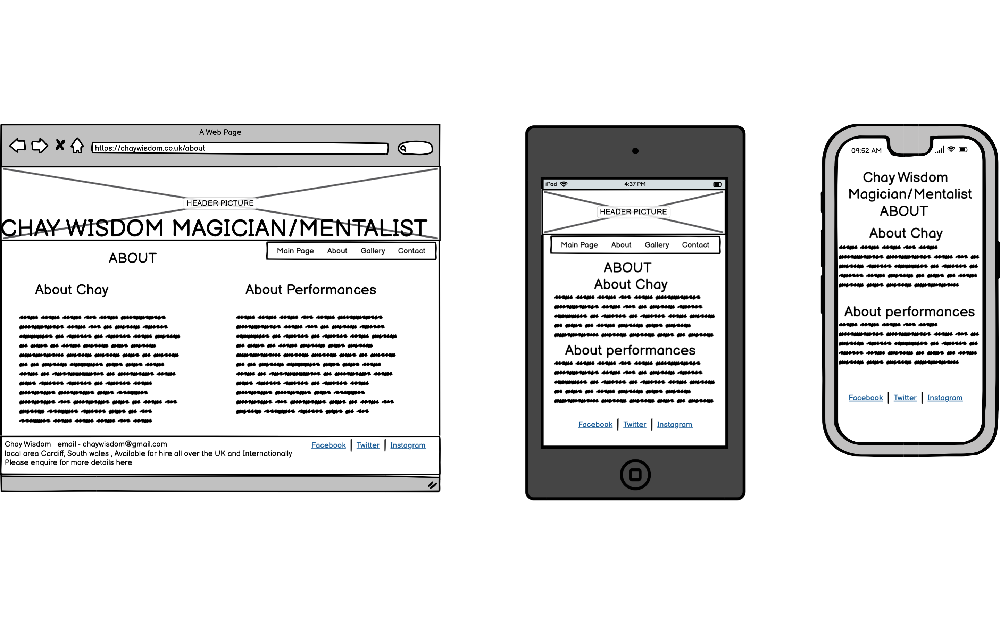

- Gallery page layout -

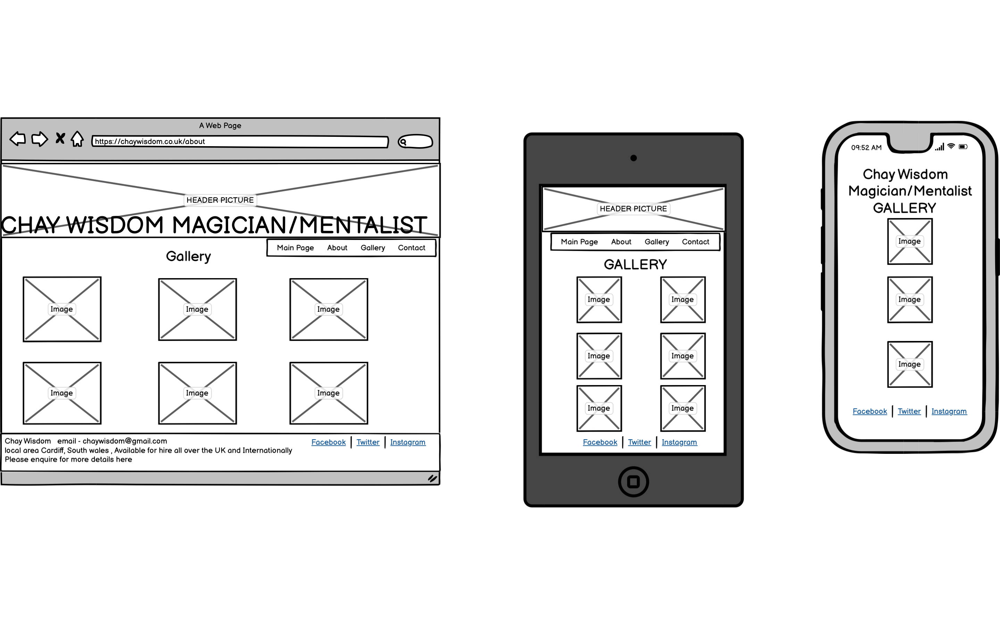

- Contact page layout -

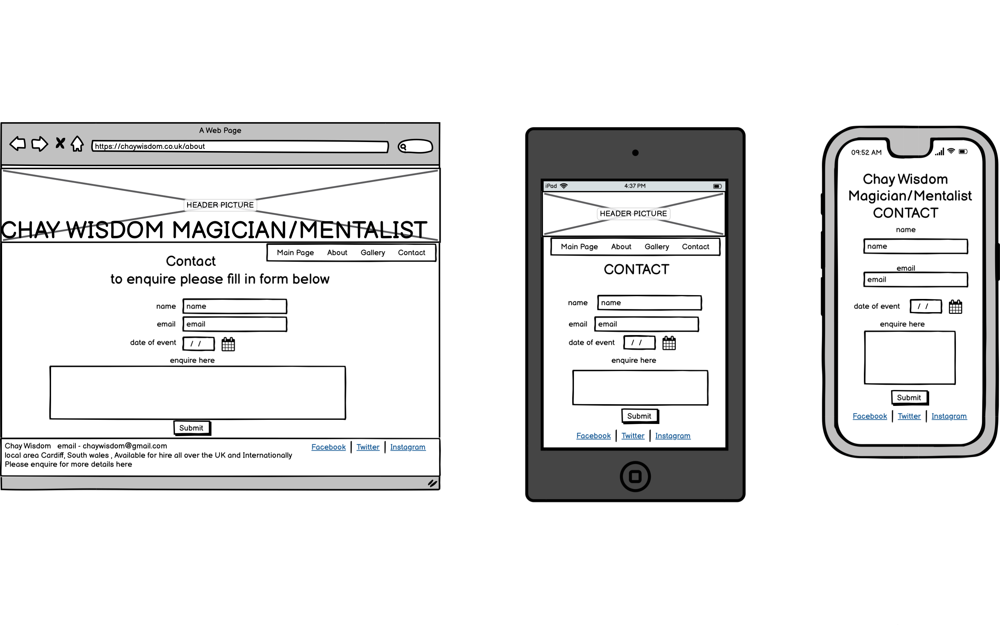

### [Back to top](#contents)

 

## DESIGN CHANGES 

Creating the website the wireframes sketched layout was used as a guide to the overall look of the website.
However some changes were made due to the aesthetics of the website once realised and sizing of promotional photos for the website. Also some additional features were added to website as  well, these features add to the aesthetic look of the website and also provide additional useful functions for the user and the business.
Design changes and additional features are listed below :-

### Header Image

- The header image used on the site is the main header image on all screen sizes, the image is repeated on larger screens due to its style the transition at the ends of the photo blend in nicely allowing the photo to use the full width of the screen.

- The performer name has been moved down to the navbar, The performers profession reamins over the bottom section of the image.

### Site Navigation

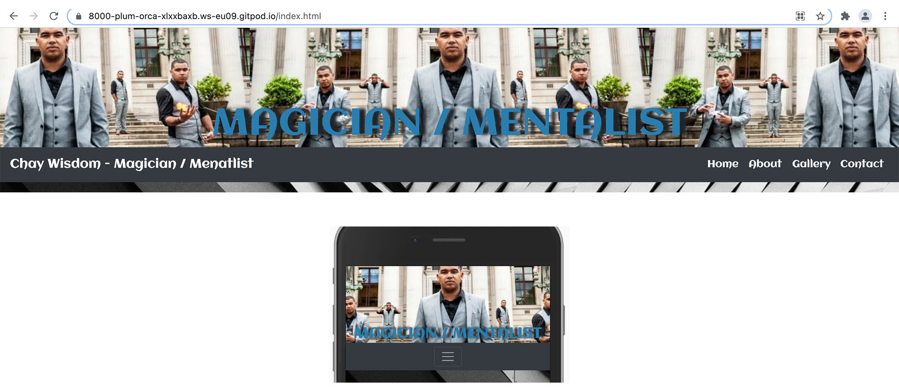

- The navbar was made using bootstrap v5.0.1 

- The navbar now runs across the whole screen below header image for better aestthetics.

- The performers name and profession was added to navbar, this is also a link to the about section, giving the use quick access if they deide they want to find out more about the performer.

- The navbar collapses into a toggler icon from bootstrap v5.0.1 when website is viewed on smaller screens

 
### Footer

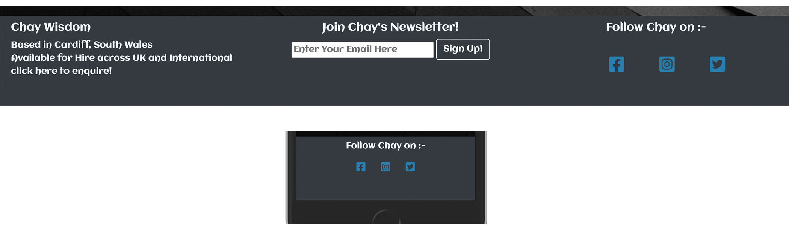

- An email submit to newsletter was added to the center of the footer. This is an additional feature which allows the performer to contact possible cilents that are interested in thier services in the form of newsletter. The newsletter can have information for possible cilents like public performances, special offers, available dates, performance demos. This also benifits the user as they can recieve these updates if they choose, helping them make a more informed decision on whether this is a service they want.

- Instead of an email address I have put in a link to the contact page which opens in a new tab. This helps the performer and the user as the contact page poses some basic questions to answer before submitting a message. This helps the user frame their question and helps the performer better understand the potenial clients position.

- The link to the contact page has the transition 'grow' which was obtained from hover.css

- The social media links use icons obtained from https://fontawesome.com/ 

- On smaller screens the footer options change to just the social media links.
 
### Main Background Image

- While creating the website the basic color intended for the background was a little plain, so a new background image was sourced from https://coolbackgrounds.io/ , the original color was reserved as a backup background.

### Quick Links

- Additional featue added while creating the website was links within the text to different sections of the website relavent to the content they are in. For example on the main page while reading the main content there are two links embedded in the text, one linking to the about page and one to the contacts page. This gives the user quick access to next piece of content they are likely wanting to access after reading the main page.
This type of link is also at the bottom of the about page linking to the contact page.

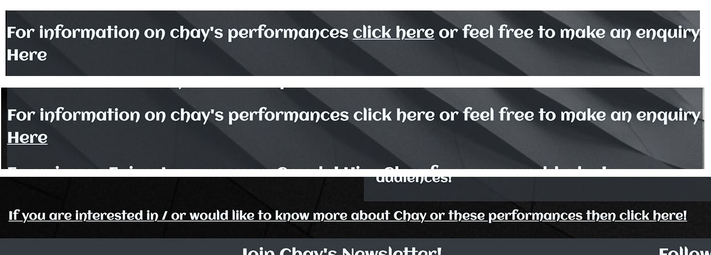

### [Back to top](#contents)

 

## CODE STRUCTURE

Folders 

 css ------------------ contains style.css ---- all CSS styling for website
             
 design-images -------- contains all images used in README.md

 gallery-images ------- contains all images used in the website gallery
 
 images --------------- contains all images used for the website layout/structure

 about.html

 contact.html

 index.html

 css/style.css ---- styling is broken down into sections below

 - body and font family for website
 - header
 - navbar 
 - footer
 - page titles
 - home page main body
 - about page
 - gallery page
 - contact page
 - media queries tablet
 - media queries mobile
 - media queries navbar fix

## CODE BUGS/FIXES

 - additional classes were made to adjust gallery images in smaller screen sizes, a quick fix the images were split into rows and adjusted in CSS.

 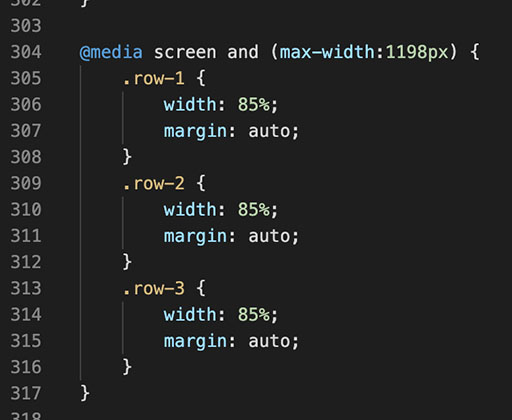

- To adjust social media icons in CSS had to target down to the i element in CSS.

- On the home page had to give the three tag lines 'experience' 'enjoy' 'impress your guests' each their own id. This was in order to position them on the page.

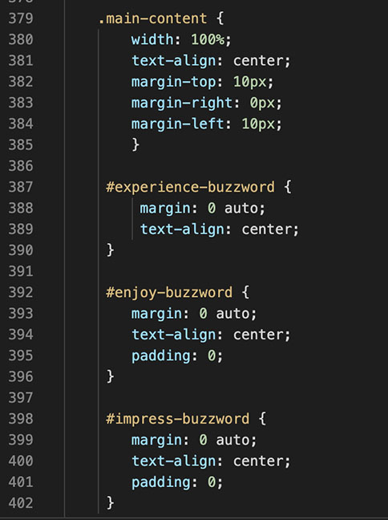

- The navbar and header image did not sit flush together on screens smaller than 509px. This was fixed by changing the title Magician/Mentalist to a smaller size 30px.

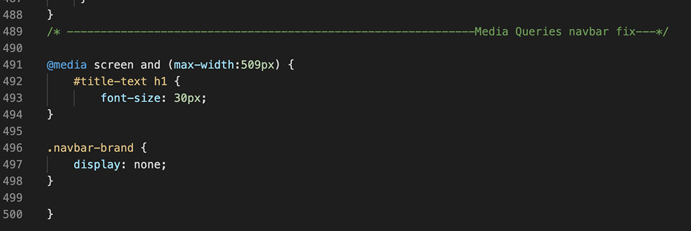

- Background Images not working in github pages.To fix needed to add ../ to file direct, also need to wait for github to load before rechecking changes as they dont take effect immediately.

#### Issues not fixed

- Issue with images in the gallery. Unable to get the images to aline as wanted. bootstrap v5.0.1  was used to help build the gallery. Possible issue with align is the div.row .col set up used and how they are spread across the screen instead of down in columns. Issue still to be fixed.

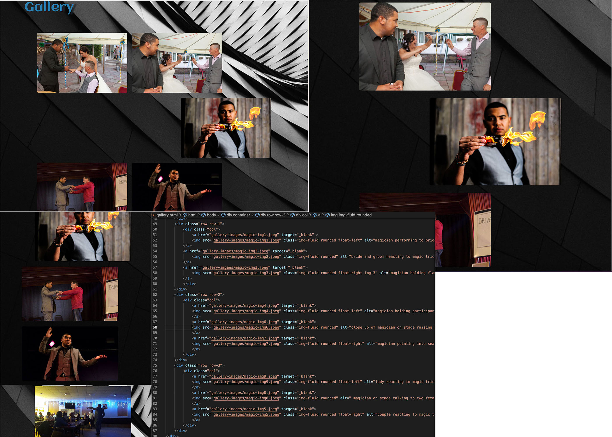

- No working link for contact form, newsletter submit to link to, knowledge not yet acquired.

## FINAL PRODUCT

### Main page top

### Main page bottom

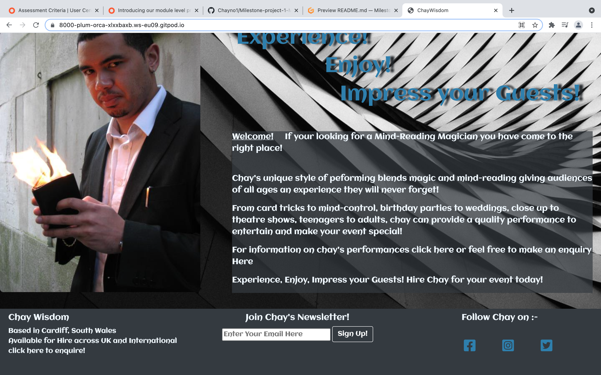

### Main page tablet

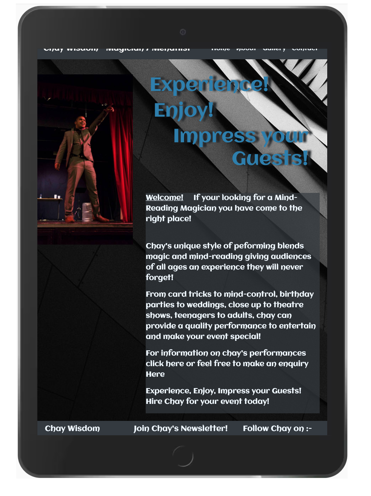

### Main page Mobile

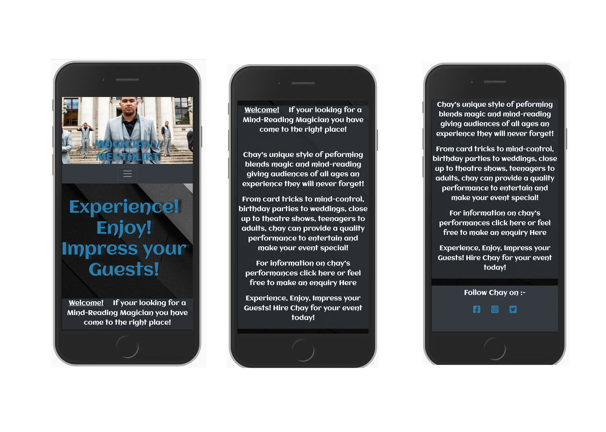

### Website Desktop/laptop 

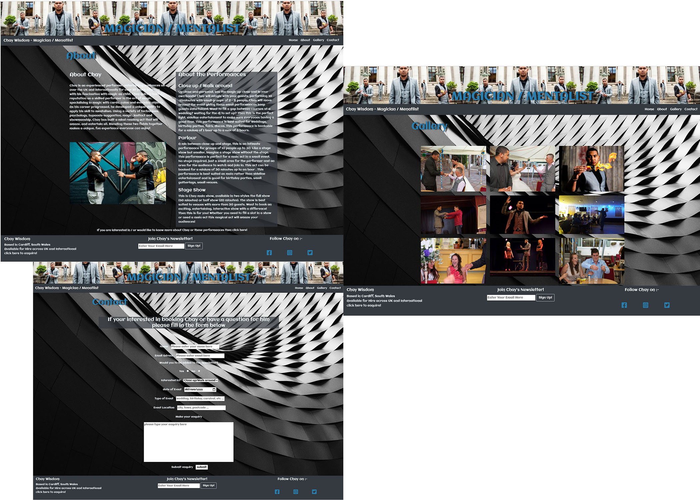

### Website Tablet

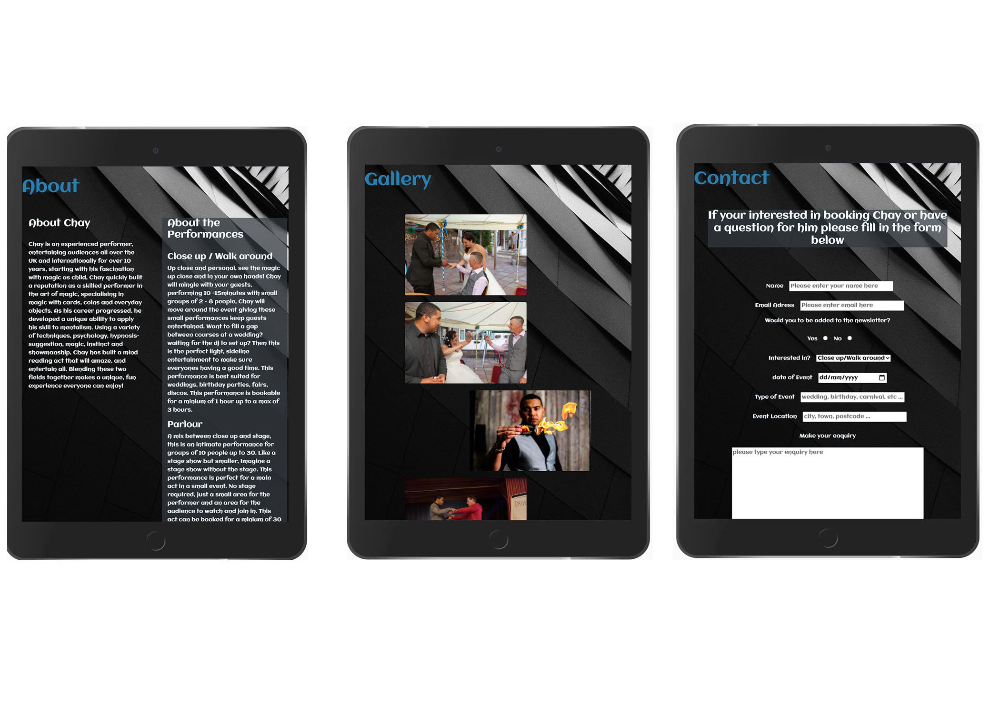

### Website Mobile

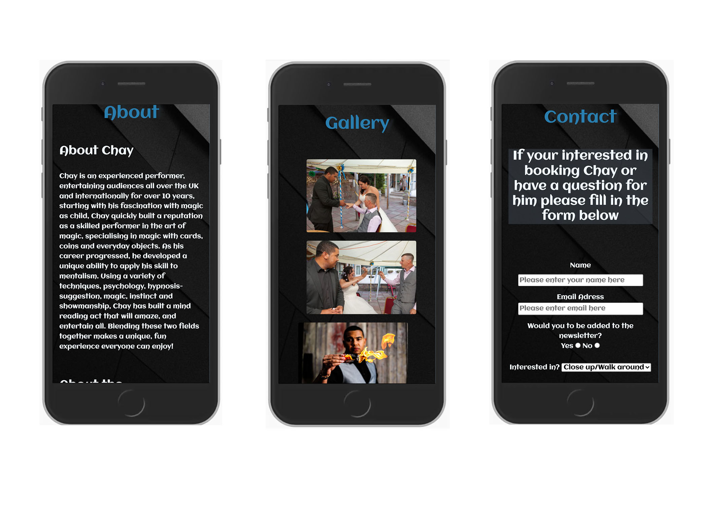

## References/ Credits 

#### Bootstrap v5.0.1

In building the website I used bootstrap v5.0.1 I used this for

 
click to expand

* https://getbootstrap.com/docs/5.0/getting-started/introduction/
* Page layout for gallery.html and about.html
*  Creating the Navbar, https://getbootstrap.com/docs/5.0/components/navbar/
* 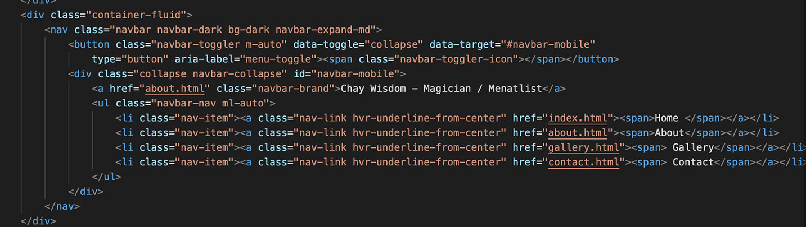
*  collapsing navbar which needed bootstrap javascript code
*  Creating the footer
* 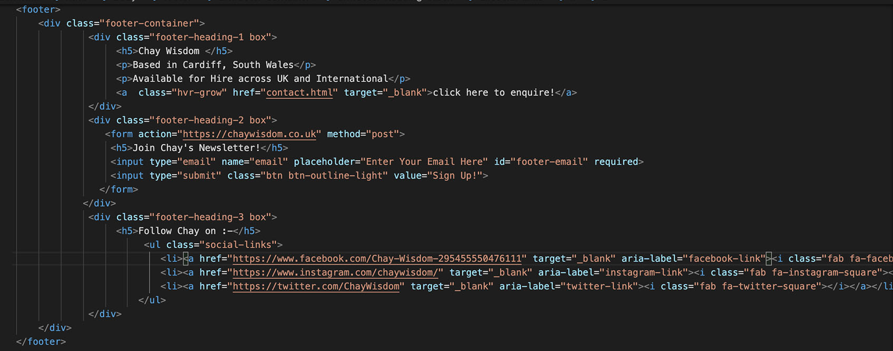

  

#### Main background image
- The background image I got from cool baackgrounds website https://coolbackgrounds.io/ from their free to use section

#### Performer and Performnces images
- All images of performer and performances are my own.

#### Navbar page link underline hover

- The underlining of page links in navabar is from Hover.css http://ianlunn.github.io/Hover/
  class: hvr-underline-from-center

#### Footer link to Contacts
- The grow transition for the 'click here to enquire' in the footer is from Hover.css http://ianlunn.github.io/Hover/

#### Footer Icons
- Icons for social medias links were obtained from fontawesome - https://fontawesome.com/

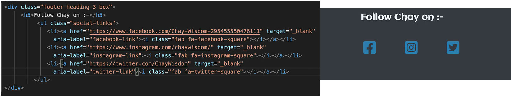

#### Font Family
- The font 'Aclonica' was obtained from google fonts - https://fonts.google.com/specimen/Aclonica 

#### Markdowncollapsible section
- I got the code for the markdown collapsible section from -
https://gist.github.com/pierrejoubert73/902cc94d79424356a8d20be2b382e1ab

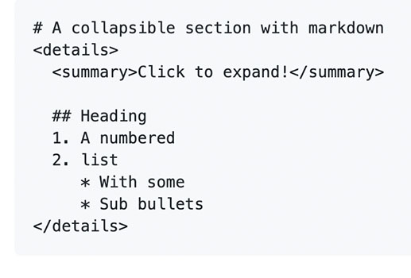

### [Back to top](#contents)

## Evaluation

### Deployment

My website is deployed on github pages -  https://chayno1.github.io/Milestone-project-1-Magician-mentalist/

How I deployed -

1. Signed in on Github.com
2. opened up my repository Milestone-project-1-Magician-mentalist
3. opened settings and clicked on pages
4. In pages clicked on source and changed from none to main then saved.
5. opened live url to check website.
6. made minor changes to image links as background links didnt intially load.
7. Rechecked live url and proceeded to test website.

## Evaluation 

### Test Website

- To evaluate and test my project I broke the testing down into two categories;
- Project objective test
- Website Build test

#### Project objective test

- This part of the test is about testing the websites ability to meet the aims intially set out for the project. This includes
  website business needs, design needs, user needs and project aim.

##### Website business needs

 - To explain the type of performer the magician is.

- To explain the type of acts the performer can provide 

- Examples of different situations/events in which the performer and their acts are best suited

- A way for anyone visiting to make enquries 

- Showcase the performers ability

Evaluation : The website covers all 5 points on business needs, 
- the performer has an intial description on the home page and a more detailed one on the home page.
- The type of acts provided are mentioned on the home page and descrided in more detail on the about page.
- Examples of different situations/events is described for each type of act on the about page.
- The contact page is specifically for users to make enquires
- The gallery showcases the performer in action in different situations at different events

Conclusion : The website achieves the busines needs to a basic level

##### Website design needs

- Website site needs to be mordern and stylish

- Unique to the performer

- Simple and easy to use

- Viewable on all sizes of devices

- website will be built with HTML,CSS

Evaluation : The website covers all 5 points on design needs,
- website uses modern link icons for social media, interesting font and images
- The website site is decorated with images of the performer, personalising the website
- The website is made of four pages with a clear easy to read navbar and a consistant header and footer on all pages
- The website is built with a responsive design, changing to fit onto different size devices
- the website was built with HTML,CSS and some JavaScript

Conclusion: The website achieves the goals of design needs to a basic level, however some coding bugs yet to fix eg gallery picture alignment
reference: [code bugs/fixes](#code-bugs/fixes) the website still has small areas of work.

####  website user needs 

- Who's website they are on, and what service they are providing.

- quickly establish where to find the information they are looking for.

- To get a feel and understanding for the performer and their ability.

- To get an understanding of the type of service they are likely to get.

- How they go about aquiring that service.

Evaluation : The website covers all 5 points on user needs,
- The performers profession and name are clearly advertised on all four pages of the website, the service provided is described on the home and about page, also demonstrated on the gallery page.
- Navbar and footer links clearly displayed on all pages, also subtle links to related pages inbedded into the content at points which the user might require, for example on the home page after reading the small description of the performer there is a link to the about page if the user wants to find out more.
- The performer and services are explained on the website, also the gallery provides action shots from live performances, showing how it looks in real life.
- The services are explained on the about page with examples given to what situations they are best suited to.

Conclusion: All the goals are achieved, again to a basic level, the illustration of the performer in action and description of services provided could be more detailed.

####  project aim

Conclusion: Overall I think the project aim was achieved, The website does the job it is required to do and does it in a simple, stylish way.
Overall it provides a strong foundation to build on with not much adjustment needed.

#### Website Build Test

  - This part of the test is about testing the websites links, responsive design, coding and background structure. This includes testing html coding, css styling, css layout, file layout and organisation.

  #### website links, responsive design,deployment
 
 Evaluation : After deploying the website I first checked that each page loaded properly which was successful after some minor adjustments image file links. I then tested the responsive design by changeing the screen size and observing how the website reacted, in which the website changed as designed apart from minor issue referenced in the [code bugs/fixes](#code-bugs/fixes).
 Next I checked all the links, the navbar links to all the pages, the footer links, social media links and main body links. I made sure that all links on all pages worked correctly and went to the correct location, also whether they opened in a new tab or changed the page as set in the coding. The website passed all these tests.

Conclusion : The frontend of the website is operating and presenting correctly as designed in the coding, no issues with overall interaction.

#### html, css, file organisation

file organisation : Due to gitpods folder creation system, the simplest and most practical way for me to organise the files was as follows.
I kept the images separate into 3 different categories design-images, gallery-images, images. The design-images folder is for all images used in the README.md, gallery-images folder is for all images used in the gallery on the gallery page. The images folder is for all images used to build the website design itself, so thats the header image, background image, images on the main body of each page except the gallery page. The style.css is contained in the CSS folder and all the html and README.md are left out of folders by themselves.
Gitpod would not allow me to place two folders within one folder without the two folders being within one another which in turn created very long file links. This layout I found was the best way without over complicating things.

html : To test my html coding first I went through each page checking for any obvious mistakes I could notice myself. I then put my code through a coder validator at https://validator.w3.org/ which flaged up two main errors. Both in the footer where I had not put a space between two classes on the button and on the link. After fixing these I ran the test again, results displayed below :

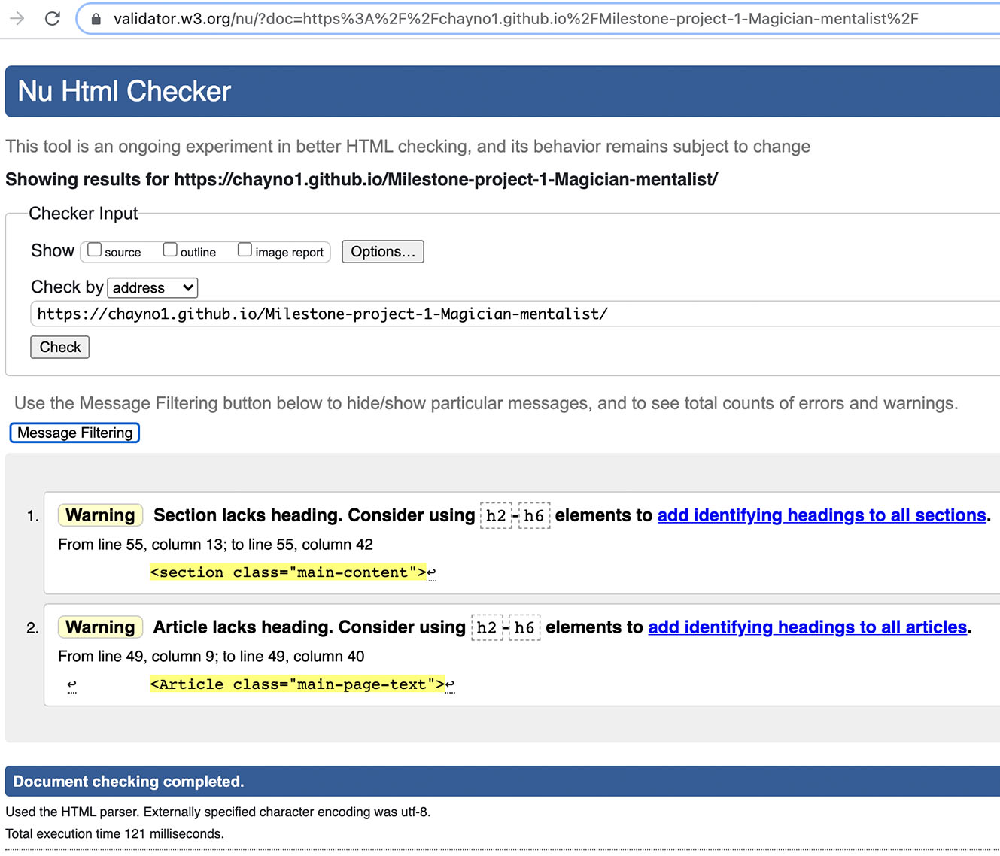

CSS : To test my css code I again went through my style.css sheet and visually looked for any obvious errors I noticed. I then put my code through an online css validator at https://jigsaw.w3.org/css-validator/ . This did flag up loads of minor errors, however I was unable to interpret what the results were indicating as the error code was not in my css file. My conclusion is the errors were to do with background code from the bootstrap classes I used on my website. As my course is not yet complete I'm unable to act at this time till I learn more about different codes. Results displayed below:

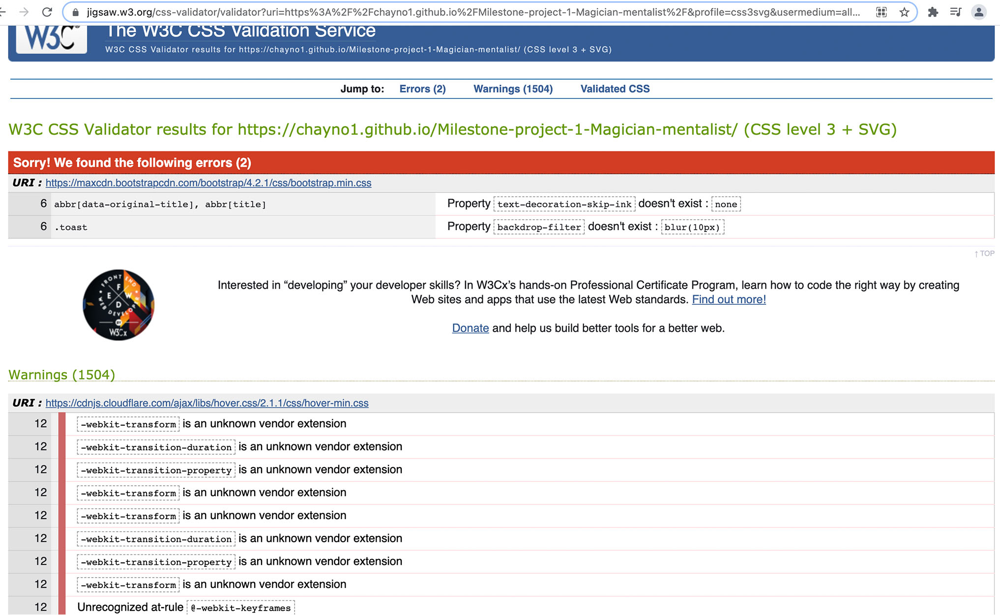
 

#### Code Checkers
 lighthouse

## Future changes/ add ons 

performance videos, blog, reviews

