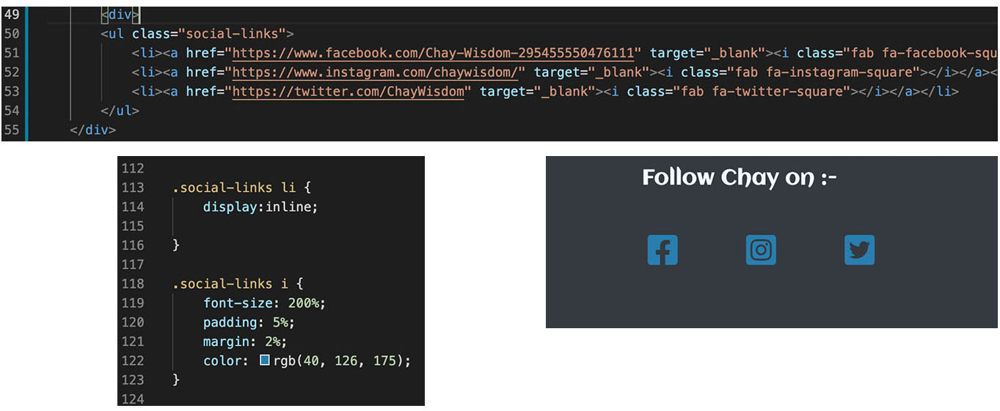

# Milestone 1 - Magician/Mentalist

 

## WHO IS THIS FOR AND WHY THEY NEED A WEBSITE.

I perform as a magician and mentalist, performing magic tricks and mind reading effects at parties,weddings, birthdays and other organised events. My act is unique as it combines traditional magic tricks  with traditinal mentalism effects reinvented for a mordern day audience. My act comes in three types of performance, close up/walkaround, parlour and stage. I take bookings for my performances and most of my bookings are aquired by word of mouth. Across the country there are lots of magicians available to book however no two magicians are the same, each magician has his or her own unique style and method of performing. In this case it is important for anyone booking a magic act to understand what type of magician they want to book and what type of act. For the magician it is important to showcase his or her own unique style and type of act they are able to perform. To help showcase this for me, I have decided to build a website to help potenial bookers get a feel and understsanding of myself as a performer and what kind of performances I do. It can also provide a way of communicating any queries regarding my services or enquirie to potenial bookings.

## PROJECT AIM

The aim of the project is to build a website that describes the performer and the services that they provide and a way of contacting the performer with questions or enquires.

## WEBSITE NEEDS (business needs)

- To explain the type of performer the magician is.

- To explain the type of acts the performer can provide 

- Examples of different situations/events in which the performer and their acts are best suited

- A way for anyone visiting to make enquries 

- Showcase the performers ability

## WEBSITE DESIGN NEEDS

- Website site needs to be mordern and stylish

- Unique to the performer

- Simple and easy to use

- Viewable on all sizes of devices

## USER NEEDS 

- Whos website they are on, and what service they are providing.

- quickly establish where to find the information they are looking for.

- To get a feel and understanding for the performer and their ability.

- To get an understanding of the type of service they are likely to get.

- How they go about aquiring that service.

## ACTION PLAN

To achieve the aim of the project I'm going to design a website consisting of 4 pages, a home page, an about page, a gallery page and a contact page.

### The Home Page

- The Home page will be the main opening page of the site, it will contain content with the overview of website, basic information describing what the web page is for and where to find relavent information.

### The About Page 

- The about page will have content about the performer him self and a description of the acts he performs and examples of when and where those acts are best suited.

### The Gallery Page

- The gallery page will be a collection of photos showcasing the performer in action performing at different events.

### The Contact Page 

- The contact page will be where visitors to the site can fill out an enquiry form to pose a question or enquire about a potenial booking.

## WEBSITE DESIGN CHOICES

### Website Navigation

- To help visitors move between the pages I'm going to input a navbar. This will sit in the header of main body of the page. 
To keep the website simple and easy to use I'm going to have the same header on every page of the site. This will help visitors intuitively understand how to move around the website.

- The header will consist of the name of the performer and performance type and navbar.

### Website Footer

- The Footer will consist of email contact details for the performer and performers local location and distance willing to travel.

- Like the Header and navbar the footer will be the same across all four pages of the site, giving the user opportunity to quickly access additional social media links or contact perofrmer from any page on the site.

- As an addition to the website I will also add links to social media for the performer, this will be placed in the footer opening in a separate tab giving the user oppertunity to find further information on the performer and also allowing them to remain on the website.

### Website Main body

- This is the area in between the header/navbar and footer where the main content as described in the action plan will sit on each page.

### colours 

- I have choosen colours for the website based off a few promotional photos for the performer, I will be using these photos as the main images on the site and will base the colours on the photos.

color used shadows
color used for header
color used for titles
color used for text

### Font Family 

- The font choosen for the website is Aclonia with sans-serif backup from google fonts :https://fonts.google.com/specimen/Aclonica 

- The font was choosen as it is stylish but still clear and easily readable. To keep the flow and look of the website simple but stylish the same font is used throughout the site.
 

## WIREFRAMES, SKETCHED LAYOUT

- Main home page layout -

- About page layout -

- Gallery page layout -

- Contact page layout -

## DESIGN CHANGES 

Creating the website the wireframes sketched layout was used as a guide to the overall look of the website.
However some changes were made due to the aesthetics of the website once realised and sizing of promotional photos for the website. Also some additional features were added to website as  well, these features add to the aesthetic look of the website and also provide additional useful functions for the user and the business.
Design changes and additional features are listed below :-

### Header Image

- The header image used on the site is the main header image on all screen sizes, the image is repeated on larger screens due to its style the transition at the ends of the photo blend in nicely allowing the photo to use the full width of the screen.

- The performer name has been moved down to the navbar, The performers profession reamins over the bottom section of the image.

### Site Navigation

- The navbar was made using bootstrap v5.0.1 

- The navbar now runs across the whole screen below header image for better aestthetics.

- The performers name and profession was added to navbar, this is also a link to the about section, giving the use quick access if they deide they want to find out more about the performer.

- The navbar collapses into a toggler icon from bootstrap v5.0.1 when website is viewed on smaller screens

 
### Footer

- An email submit to newsletter was added to the center of the footer. This is an additional feature which allows the performer to contact possible cilents that are interested in thier services in the form of newsletter. The newsletter can have information for possible cilents like public performances, special offers, available dates, performance demos. This also benifits the user as they can recieve these updates if they choose, helping them make a more informed decision on whether this is a service they want.

- Instead of an email address I have put in a link to the contact page which opens in a new tab. This helps the performer and the user as the contact page poses some basic questions to answer before submitting a message. This helps the user frame their question and helps the performer better understand the potenial clients position.

- The link to the contact page has the transition 'grow' which was obtained from hover.css

- The social media links use icons obtained from https://fontawesome.com/ 

- On smaller screens the footer options change to just the social media links.
 
### Main Background Image

- While creating the website the basic color intended for the background was a little plain, so a new background image was sourced from https://coolbackgrounds.io/ , the original color was reserved as a backup background.

### Quick Links

- Additional featue added while creating the website was links within the text to different sections of the website relavent to the content they are in. For example on the main page while reading the main content there are two links embedded in the text, one linking to the about page and one to the contacts page. This gives the user quick access to next piece of content they are likely wanting to access after reading the main page.
This type of link is also at the bottom of the about page linking to the contact page.

## CODE BUGS/FIXES

 - additional classes were made to adjust gallery images in smaller screen sizes, a quick fix the images were split into rows and adjusted in CSS.

 

- To adjust social media icons in CSS had to target down to the i element in CSS.

- On the home page had to give the three tag lines 'experience' 'enjoy' 'impress your guests' each their own id. This was in order to position them on the page.

- The navbar and header image did not sit flush together on screens smaller than 509px. This was fixed by changing the title Magician/Mentalist to a smaller size 30px.

#### Issues not fixed

- Issue with images in the gallery. Unable to get the images to aline as wanted. bootstrap v5.0.1  was used to help build the gallery. Possible issue with align is the div.row .col set up used and how they are spread across the screen instead of down in columns. Issue still to be fixed.

- No working link for contact form, newsletter submit to link to, knowledge not yet acquired.

## FINAL PRODUCT

### Main page top

### Main page bottom

### Main page tablet

### Main page Mobile

### Website Desktop/laptop 

### Website Tablet

### Website Mobile

## References/ Credits 

The background image I got from cool baackgrounds website https://coolbackgrounds.io/ from their free to use section

The grow transition for the 'click here to enquire' in the footer is from Hover.css http://ianlunn.github.io/Hover/

https://getbootstrap.com/docs/5.0/components/navbar/

https://fontawesome.com/

## Evaluation

## Future changes/ add ons 
